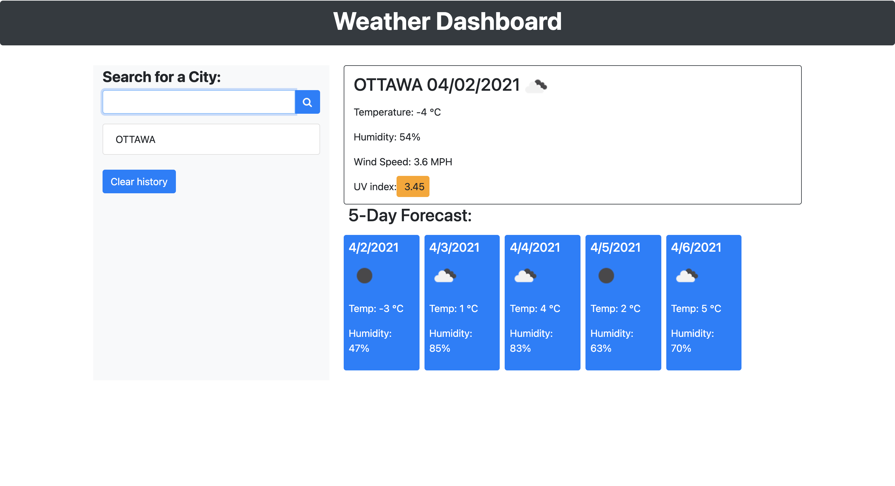
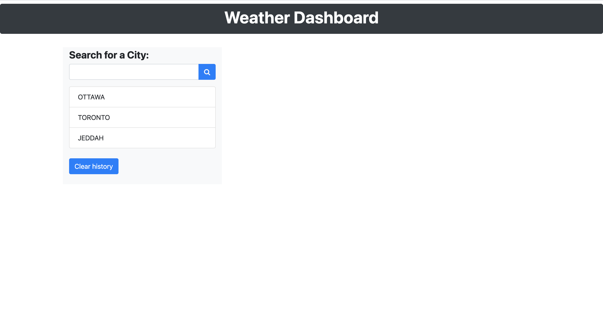

# Weather-Dashboard

## Table of contents

- General info
- Screenshot
- Deployment of application 

## General Info
Weather Dashbord was develop by using HTML, Bootstrap, CSS, JavaScript and third party API [Open weather API](https://openweathermap.org)
## Screenshot

### Start Page

### After searching for one city

### After Searchinf for tow ctities

### After relode the page 

##Deployment of application

[Weather Dashbord](https://hakeem235.github.io/Weather-Dashboard/)

##GitHub Repo link

[GitHub Repo](https://github.com/hakeem235/Weather-Dashboard)
